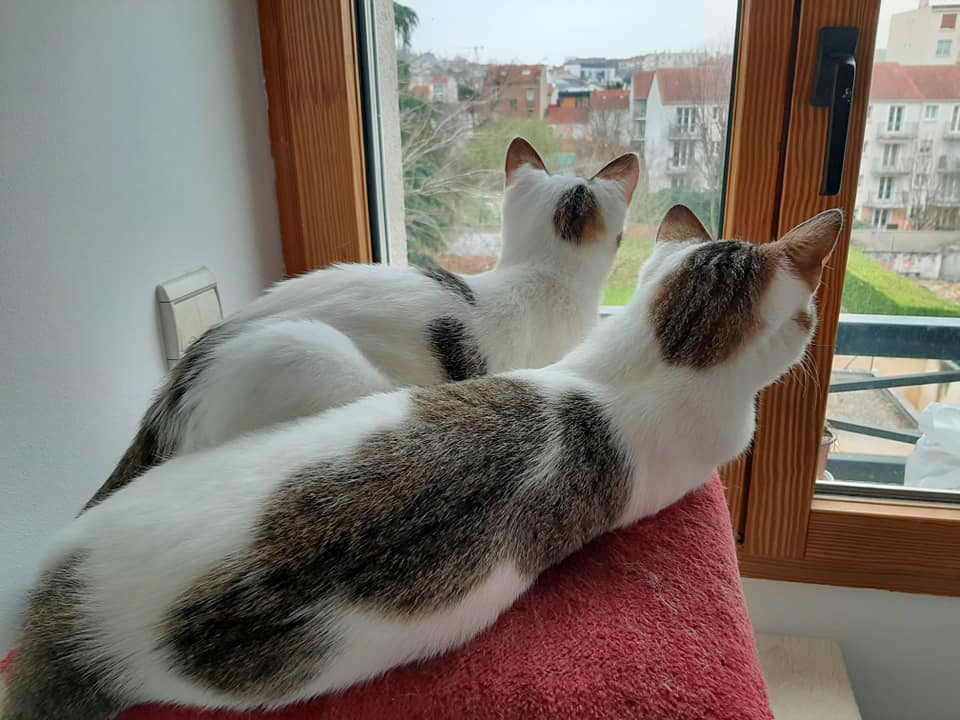
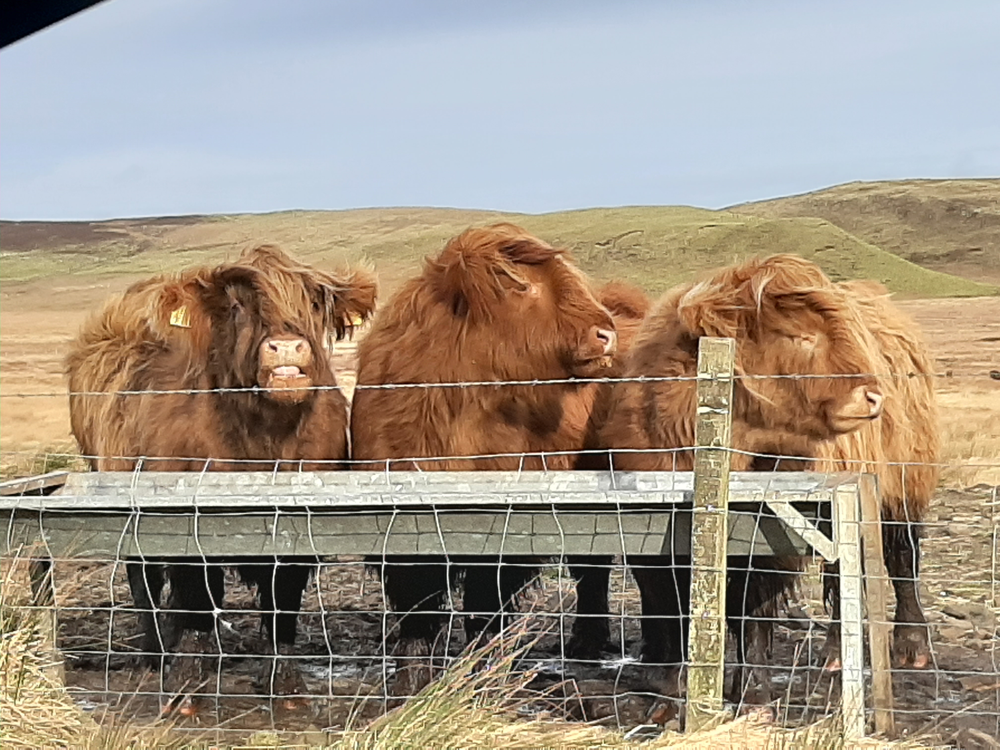
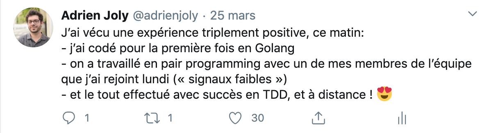

<iframe class="img" src="https://www.youtube.com/embed/_yfizXzgswM" frameborder="0" allow="accelerometer; autoplay; encrypted-media; gyroscope; picture-in-picture" allowfullscreen></iframe>

Nous en sommes à deux semaines de confinement pour ralentir la contagion du coronavirus (voir [cette vidéo de Paris, vide](https://www.youtube.com/watch?v=_yfizXzgswM)). Dans ces circonstances, on ne rate pas d'occasion de s'échanger les nouvelles. Et surtout, on ne manque pas de choses à se dire. On découvre (presque) tous une nouvelle façon de vivre et de travailler. Notre quotidien, nos habitudes et même nos réflexes sont chamboulés. Les plateformes de communication par internet n'ont probablement jamais été aussi utilisées qu'en ce moment.

J'ai plaisir à échanger les nouvelles plus ou moins régulièrement avec mes proches, famille et amis, et à mettre à jour de temps en temps ma page [/now](/now). Mais vu le caractère exceptionnel de la période que nous vivons, j'ai envie d'aller un peu plus loin: partager non seulement mes nouvelles, mais aussi comment je me sens, et comment j'appréhende la suite des événements, pour moi et pour le monde. Je me dis que je serais sûrement heureux de pouvoir relire ces notes, ce témoignage, quelques années plus tard.

## La Santé

Commençons par le plus important: la santé. Au delà d'avoir la chance d'être en bonne santé et de ne pas attrapé le virus (à priori), je me sens très bien en ce moment. Mon moral est probablement aidé par les récents changements professionnels que je vais décrire plus bas, mais aussi parce qu'être enfermé à la maison n'a jamais été un problème pour moi, pour autant que je me souvienne. De nature plutôt introvertie (c.a.d. que les contact sociaux me prennent beaucoup d'énergie, et j'ai besoin d'être seul longtemps pour "recharger"), je suis pour l'instant très heureux à la maison, je ne manque de rien, et je ne m'ennuie jamais !

Camille a eu moins de chance, vu qu'elle a de la fièvre et se sent faible depuis 2 semaines. Mais la baisse des demandes de prestations de photographe fait qu'elle peut se reposer, ce qui est une bonne chose.

Ma famille aussi va bien. Il faut dire qu'on a l'habitude de pas se voir souvent de toute façon, car Romain est basé au Luxembourg, Charlotte en Corse, et mes parents dans les Bouches du Rhône. Je croise les doigts pour que ma petite sœur conserve la santé, malgré le fait qu'elle travaille dans une maison de retraite dans laquelle COVID-19 a déjà fait quelques victimes...

Mon papi va bien, lui aussi, et il n'a pas l'air d'être inquiet. J'aime croire qu'il a trouvé un bon compromis entre la tranquillité chez lui, un contact régulier avec la famille (plutôt par téléphone, en ce moment, mais aussi via des [gazettes Famileo](https://www.famileo.com/) pleines de photos qu'on lui envoie chaque mois), un bon suivi médical à domicile, et des voisins adorables qui ne ratent aucune occasion de lui rendre service.

## La Maison

Après avoir vécu 7 ans avec Camille dans un 2 pièces de 32m2, et malgré le fait qu'on adorait cet appartement, nous avons eu la chance de déménager dans un beau duplex de 3 pièces, bien plus spacieux, en Novembre dernier. C'était un lourd investissement, mais je suis impressionné de constater à quel point ce changement d'environnement a impacté positivement notre quotidien !

Notamment, le plaisir d'être câliné par nos chats à notre réveil, et de pouvoir prendre un bain de soleil dans notre salon, pendant notre petit déjeuner. Mais aussi le confort d'avoir une chambre en plus qui me sert de bureau (très utile en période de confinement) et où je peux m'isoler pour jouer et faire un peu d'exercice avec mon casque de réalité virtuelle, sans (trop) déranger Camille.

Photo: Camille Betinyani Chacur

## Le Travail

Au niveau professional, je suis passé par quelques changements assez substantiels. Ces dernières semaines, bien sur, mais aussi ces derniers mois.

<iframe class="img" src="https://www.youtube.com/embed/CpFqPVmMeaE" frameborder="0" allow="accelerometer; autoplay; encrypted-media; gyroscope; picture-in-picture" allowfullscreen></iframe>

Fin Janvier, j'ai quitté Algolia. J'y ai travaillé un peu plus de deux ans, pour développer un système d'indexation de pages web (aussi appelé "web crawler") pour nos clients, et pour conduire l'équipe de développement. Algolia étant une belle startup (fondée en France) en pleine croissance internationale, le rythme y était encore plus effréné que quand j'étais en charge du développement de la startup Whyd (jusqu'en 2015).

En rétrospective, ces deux ans ont été très formateurs (notamment au niveau technique, _leadership_ et _soft skills_) mais aussi très éprouvants pour moi, psychologiquement parlant. En effet, il m'aura fallu plus d'un an pour comprendre que la nature de ce que j'apportais à mon équipe n'était pas alignée avec ce qui était attendu de moi. Le résultat est que j'ai dépensé énormément d'énergie sur des actions qui me paraissaient importantes pour l'équipe et pour Algolia. Et j'étais frustré de recevoir moins de reconnaissance que je l'espérais.

Au final, j'ai aidé mon équipe à grandir et à construire ensemble un produit dont je suis fier sur le plan fonctionnel. Par contre, je ne suis pas parvenu à convaincre mes équipiers d'améliorer ensemble la robustesse et la maintenabilité de notre produit au niveau que je souhaitais qu'on atteigne. C'est cette frustration qui m'a donné envie d'aller voir ailleurs, et finalement: de quitter Algolia.

Parallèlement à ces épreuves, je me suis rendu compte que mon budget était trop faible pour pouvoir déménager dans un appartement à la hauteur de mes espérances, suite à l'évolution du marché de l'immobilier. À l'époque, j'avais négocié un CDI aux quatre cinquièmes pour pouvoir continuer à enseigner sans sacrifier de (trop nombreux) weekends et jours de congés. L'été dernier, j'ai donc pris la décision de renoncer à ce 4/5 pour cumuler un plein temps chez Algolia et 15 jours de cours à donner par an.

Inutile de dire que j'étais soulagé de pouvoir faire une coupure d'un mois entre mon départ d'Algolia et mon premier jour chez mon nouvel employeur: SHODO. J'ai pu profiter de ce mois de Février pour me reposer, mais aussi pour partir en vacances avec Camille: un road trip de 11 jours en Écosse ! Malgré les tempêtes quasi-permanentes qui s'en prenaient au Nord-Ouest de l'Europe à cette période là, ce séjour m'aura fait beaucoup de bien. Et j'estime que nous avons eu beaucoup de chance d'avoir pu l'effectuer avant que notre gouvernement décide le confinement.

Photo: Camille Betinyani Chacur

De retour à la maison, j'ai eu le plaisir de pouvoir héberger quelques jours mes parents pour la première fois de ma vie. Puis j'ai rejoint mes nouveau collègues, chez SHODO. Au delà d'être heureux de rejoindre une jeune entreprise aux valeurs qui me ressemblent (cf l'article "[Pourquoi SHODO ?](https://medium.com/shodo-io/pourquoi-shodo-4793396b7199)"), j'ai été accueilli comme un VIP !

On a commencé par un délicieux déjeuner au restaurant avec une bonne partie de l'équipe. J'étais touché de sentir que les cofondateurs étaient aux petits soins pour que mon intégration se passe au mieux, et que je ne manque de rien. Et ce, malgré le fait que je n'avais pour l'instant pas de client, et donc, que je ne leur rapportais rien. Puis j'ai suivi une formation "[BDD](https://en.wikipedia.org/wiki/Business-driven_development)", une méthode pour mieux capter les besoins du client, dans l'intention d'être plus efficace et pérenne dans son processus d'ingénierie logicielle. Enfin, j'ai eu le sentiment d'être intégré au cercle des _Jedi du code_, en pratiquant des [Katas](https://en.wikipedia.org/wiki/Kata_(programming)) avec mes collègues, comme ça se fait couramment dans le monde du [Software Crafts(wo)manship](https://en.wikipedia.org/wiki/Software_craftsmanship). (parfois appelé "Artisans Logiciel", en Français)

La semaine du 16 Mars, il était prévu que je donne un cours d'une semaine entière à une classe de 20 étudiants d'une des écoles dans lesquelles j'interviens régulièrement. Comme le gouvernement venait d'établir le confinement, j'ai finalement donné ce cours depuis chez moi, en visioconférence !

Le plus frustrant, dans cette expérience de prof à distance, c'était de ne pas pouvoir voir l'expression sur le visage de mes étudiants pendant le cours. Leur expression me permet d'estimer leur niveau de motivation et de compréhension, et donc de "rattraper" les étudiant•e•s qui décrochent, avant qu'il ne soit trop tard. Pour combler à ce manque, je lançais très régulièrement des sondages, pour leur demander à quel exercice ils en étaient. Et je leur montrais comment procéder quand je me rendais compte qu'ils étaient nombreux à être bloqués sur un même exercice. Pour le reste, ça s'est plutôt bien passé, si j'en crois les retours que m'ont donné les étudiant•e•s à la fin de la semaine de cours. Probablement parce que le plus gros de mes cours consiste à leur faire faire des exercices de codage sur leur propre ordinateur, et parce que les évaluations que je donne ont toujours été conçues pour être réalisées sur leur ordinateur, avec accès à internet.

Enfin, la semaine suivante, j'ai démarré ma première mission en clientèle depuis mon entrée chez SHODO: aider la Startup d'État "[Signaux Faibles](https://beta.gouv.fr/startups/signaux-faibles.html)" à consolider son processus d'intégration de données. Comme pour mon entrée chez SHODO, mon intégration s'est très bien passée. Je suis ravi par la finalité du projet, mon entente avec l'équipe, les défis techniques sur lesquels je m'engage et par le fait que l'équipe valorise ma manière de faire. En plus, le confinement n'est pas du tout un problème pour eux, car ils ont l'habitude de travailler à distance. Bref, ce projet et cette nouvelle page de ma carrière commencent très bien !

## Et ensuite ?

Cet article est déjà plus long que je l'imaginais. J'évoquerai donc dans un second article les nouvelles de mes autres projets ainsi que quelques reflexions liées au confinement.

En attendant, continuez à rester chez vous, et prenez bien soin de vous et de vos proches !

Adrien
