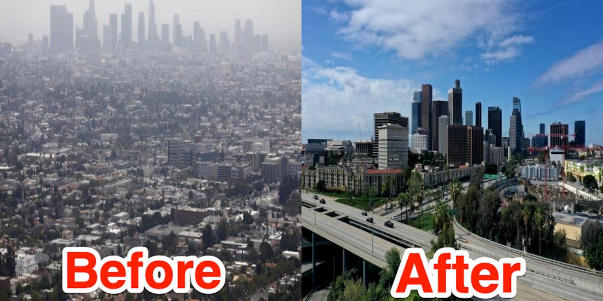

Il y a trois semaines, je publiais des nouvelles de Camille et moi sur un ton serein (lire "[Confinement, entre autres nouvelles – Partie 1](https://adrienjoly.com/posts/2020-03-29-confinement/)"), jurant de partager prochainement quelques reflexions liées au confinement. (et aussi des *nouvelles de mes autres projets*, mais je ferai ça plus tard)

J'avais deja pris quelques notes de réflexions et idées qui me venaient en lisant les actualités et opinions relayées par les gens que je suis sur Twitter, et celles de notre entourage. Ce matin, j'ai été **contrarié** par la réaction enthousiaste de nombreuses personnes influentes de la Silicon Valley, sur un article publié par [Marc Andreessen](https://twitter.com/pmarca) (un des investisseurs les plus renommés et influents de la Silicon Valley, notamment en pariant sur le succès d'Instagram, Oculus VR et GitHub): "[IT'S TIME TO BUILD](https://a16z.com/2020/04/18/its-time-to-build/)". (oui, le titre est bien écrit tout en majuscules)

Cet article et les réactions à cet article m'ont poussé à partager [mon opinion en quelques tweets](https://twitter.com/adrienjoly/status/1251770866049986561), et m'ont donné la motivation pour rédiger et publier – en français, cette fois – quelques reflexions et espoirs pour notre société, au sortir du confinement et de la crise du COVID-19.

Alors, que dit l'article de Marc Andreessen, et pourquoi m'a-t-il contrarié?

## Critique de l'article

Pour tenter de résumer ce que Marc Andreessen dit dans son article: la société – États-Unienne, je suppose – aurait pu éviter d'entrer en crise à cause du COVID si elle avait plus investi dans la construction de biens immobiliers et matériels. Il accuse les politiques de droite de manquer d'audace pour investir dans de grands chantiers. Et il met au défi les politiques de gauche de prouver qu'une gestion publique/nationale de la filière sanitaire peut être efficace et efficiente, plutôt que d'accuser ou de critiquer. *Show, don't tell*, soit !

La partie qui me donne la chair de poule est son appel à *redémarrer le Rêve Américain* en *construisant des choses en quantités immenses*, de manière à faire réduire leur coût, et donc permettre aux familles de prospérer.

> " *Where are the supersonic aircraft? Where are the millions of delivery drones? Where are the high speed trains, the soaring monorails, the hyperloops, and yes, the flying cars?* "

> " *In fact, I think building is how we reboot the American dream. The things we build in huge quantities, like computers and TVs, drop rapidly in price. The things we don’t, like housing, schools, and hospitals, skyrocket in price. What’s the American dream? The opportunity to have a home of your own, and a family you can provide for. We need to break the rapidly escalating price curves for housing, education, and healthcare, to make sure that every American can realize the dream, and the only way to do that is to build.* "

> " *Our nation and our civilization were built on production, on building. Our forefathers and foremothers built roads and trains, farms and factories, then the computer, the microchip, the smartphone, and uncounted thousands of other things that we now take for granted, that are all around us, that define our lives and provide for our well-being. There is only one way to honor their legacy and to create the future we want for our own children and grandchildren, and that’s to build.* "

En somme, Marc propose de poursuivre la stratégie qui a permis aux États-Unis de se développer: faire travailler ses citoyens pour produire des biens qui seront vendus à d'autres, afin que ces derniers aient à leur tour besoin de travailler, tout en leur donnant espoir de pouvoir un jour atteindre une meilleure qualité de vie.

À ce stade, faisons abstraction de l'insidieuse manipulation qui consiste créer de l'espoir chez des millions de *petites mains* sous-payées, pour augmenter le confort des quelques *qui s'en sont sortis*.

Ce qui me choque, c'est:

1. le fait que Marc ait fait complètement abstraction des effets du COVID que nous observons aujourd'hui dans le monde, ainsi que des effets que sa politique de construction aurait sur le monde;
2. et l'absence de prise de recul, de remise en question du mode de vie et de travail de notre société.

Alors je propose de m'essayer à cet exercice, en commençant par lister les effets sur le monde du COVID et de la stratégie proposée par Marc. Puis je partagerai quelques pistes de remise en question de nos modes de vie et de travail, dans la société post-COVID.

## Effets possibles d'une politique de construction de masse

Je vois deux effets potentiellement néfastes à une politique de construction de masse telle que celle suggérée par Marc Andreessen:

1. Un lourd impact environnemental, et donc sanitaire.
2. Une aggravation des inégalités sociales.

### 1. Impact environnemental et sanitaire

Il est certes nécéssaire de construire des biens et des infrastructures pour que les citoyens puissent se loger, se nourrir, rester en bonne santé, mais aussi se distraire.

En revanche, gardons en tête que:

- Toute **construction** présente des coûts de natures multiples, car elle mobilise – entre autres – des matières premières, des moyens de production et de maintenance, puis l'**usage des biens produits** mobilise lui-aussi des ressources (ex: énergies), et leur coût s'ajoute donc à l'addition, même si c'est de manière indirecte.
- Que les **matières premières** aient été achetées à d'autres ou extraites depuis son propre territoire, leur exploitation a aussi un coût. Par exemple: l'extraction de pétrole coute de plus en plus cher car il est de plus en plus difficile à trouver. L'usage de pétrole revient extrêmement cher lorsqu'un pétrolier perd sa cargaison en mer. Quant à elles, les centrales nucléaires génèrent des déchets radioactifs dont nous déléguons la gestion aux générations futures. (ce coût se cache donc sous forme d'une **dette**)

Sachant que l'exploitation de matières premières repose en grande partie sur des ressources naturelles non renouvelables (car extraite de nos sols), et que nous ne savons pas encore recycler tous les matériaux que nous utilisons, nous devons accepter que nous ne pouvons construire qu'une **quantité limitée** de biens. D'où l'importance de réfléchir posément sur nos priorités, avant de lancer une politique de construction à toute allure.

Par ailleurs, et même en faisant abstraction des catastrophes écologiques (citées plus haut) qui peuvent être occasionnées, l'exploitation de ces matières premières produit des **déchets** qui ont un impact négatif sur notre environnement, et donc sur notre **santé**. Je ne parle pas seulement de la santé des personnes travaillant encore dans des mines ou même celles recyclant nos déchets toxiques au péril de leur vie, mais aussi de celle de tous les humains et animaux qui comptent sur l'air de notre atmosphère pour respirer, et sur l'eau de nos nappes phréatiques pour boire.

Je veux bien admettre qu'il pourrait être utile de construire quelques hôpitaux, mais ne serait-il pas ironique que nos enfants se retrouvent contraints de filtrer l'air de l'atmosphère sous prétexte qu'à un moment donné nous étions trop nombreux à avoir attrapé la même maladie, au même moment ? Et ce, sachant que nous aurions pu réduire cette contagion en prenant quelques **précautions** supplémentaires ?

Plus nous construisons, plus nous compromettons notre santé. L'enjeu n'est donc pas de construire plus, mais de trouver un équilibre entre construire ce que nous avons vraiment besoin de construire et adapter nos habitudes afin de réduire ces besoins.

### 2. Impact social

Si une société "occidentale" (comme les États Unis et la France) construit plus, elle devrait naturellement susciter plus de consommation et d'**envie de consommer**.

Rappelons que, dans ce modèle de société, l'accessibilité des biens est généralement soumise à la **loi du marché**. C'est à dire que si un produit est très demandé mais disponible en faible quantité, son prix augmente, et il ne devient alors accessible qu'à une tranche plus fortunée de la population.

Sachant que la production de biens a un coût et que la capacité de production est limitée par la disponibilité des matières premières nécessaires, il me semble que la mise en place d'une politique de construction à outrance dans notre société ne ferait qu'aggraver les inégalités sociales. En effet, les citoyens les plus modestes ne pourraient pas forcément accéder à plus de biens dont ils ont besoin. Pourtant, ils auront moins de moyens que les citoyens plus aisés pour se protéger des **conséquences sanitaires** (ex: pollution de l'air et de l'eau) de cette politique de production exacerbée.

Une manière d'éviter cette situation serait de **réguler la production et la distribution** de certains biens essentiels à tous les citoyens, de manière à ce que tous puissent en profiter de manière égale, quelque soit leur situation. Mais cette idée faire naître nombreuses questions: quels biens doivent-ils être qualifiés d'essentiels, qui sera en charge de produire ces biens, à quel coût, et qui sera en charge et garant d'une telle régulation ?

Je trouve dommage que Marc n'apporte pas d'idées ni même de questions à ce sujet, dans son article.

## Effets du COVID et du confinement

Maintenant que j'ai partagé les raisons de mon scepticisme quant à la vision décrite par Marc Andreessen dans son article, j'aimerais prendre le temps d'observer les effets que le COVID et le confinement ont eu sur notre vie et sur notre environnement.

### 1. La nature reprend (un peu) ses droits

<iframe class="img" src="https://www.youtube.com/embed/e3FgDKS0tx0" frameborder="0" allow="accelerometer; autoplay; encrypted-media; gyroscope; picture-in-picture" allowfullscreen></iframe>
A Paris, les canards profitent du confinement pour sortir | AFP Images

Quelle joie de voir, au travers de cette vidéo, des canards errer sans crainte dans Paris !

L'argument peut paraitre léger, mais je vois ce fait divers comme une opportunité de se rappeler que le sol qui se trouve sous le goudron de nos villes ne nous appartient pas.

C'est un bout de terre que nous nous sommes approprié et que nous avons recouvert pour rendre plus efficaces nos déplacements en voiture. Voiture que nous avons acheté pour pouvoir nous éloigner de notre lieu de travail, afin de pouvoir nous permettre d'accéder à une autre parcelle de terre plus agréable pour vivre avec notre famille, moins chère car éloignée de la ville.

Il est devenu étrange de voir des canards se balader dans notre ville car notre appropriation de ce bout de terre l'a rendu inhospitalier à nombreuses espèces animales, préférant alors (habituellement) rester en retrait.

Cette image montre une version plus paisible, agréable et harmonieuse de notre ville, que nous n'aurions pas pu observer si nous n'avions pas accepté de rester confinés chez nous pendant plusieurs jours.

Ce confinement aura donc au moins le mérite de nous montrer une réalité alternative qui nous paraissait impossible, mais qui s'avère l'être. (certes, par la force des choses)

### 2. Notre atmosphère reprend des couleurs

Source photo: <a href="https://www.businessinsider.fr/us/photos-stay-at-home-order-reduced-los-angeles-notorious-smog-2020-4" target="_blank">Before and after photos show how stay-at-home orders helped Los Angeles significantly reduce its notorious smog</a>

Depuis des années, le GIEC nous alerte de manière répétée sur le **réchauffement climatique** que cause notre société. L'augmentation de la fréquence des vagues de chaleur et des turbulences atmosphériques sont des exemples de manifestations de ce réchauffement. Pourtant, rares sont les pays qui se sont véritablement engagés sur une réduction substantielle des gaz à effets de serre qu'ils émettent. Alors que la population est de plus en plus sensibilisée à ce sujet, le manque d'engagement de nos gouvernements pourrait laisser croire que le mal est déjà fait et qu'il nous est impossible de retrouver un environnement sain, donc autant continuer comme si de rien n'était.

Et là, cas de force majeur: pour réduire l'engorgement des nos hôpitaux croulant sous un nombre inédit de patients nécessitant une assistance respiratoire (à cause du COVID, donc), la santé prend le pas sur l'économie. C'est une condition suffisante pour demander à la majorité des travailleurs de rester chez eux. Et nous découvrons alors avec émoi à quoi ressemble le ciel de Los Angeles quand il est pas pollué par les gaz d'échappements de ses citadins. Il serait donc **possible** de rendre notre air à nouveau respirable ? Mais, dans ce cas, ne serait-il pas également possible d'annuler (ou à minima, de ralentir substantiellement) le réchauffement climatique ?

Alors, oui, cette pause temporaire d'activité a mis des millions de personnes dans une situation critique (ex: perte d'emploi, de sécurité sociale), sans parler des petites et moyennes entreprises dont les modestes finances n'auront pas les reins assez solides pour affronter cette épreuve...

Mais est-ce vraiment la faute d'un virus trop agressif ? Ou est-ce celle d'un modèle social souffrant d'un **manque de résilience** ?

Une chose est certaine: nous venons de prouver que le ciel de Los Angeles pouvait redevenir bleu en un mois et que la Chine pouvait réduire son taux de particules fines de 20 à 30% en trois mois.

Maintenant que nous disposons de preuves que la situation environnementale peut s'améliorer en peu de temps, nous n'avons plus d'excuses: nous devons trouver des solutions pour réduire notre empreinte carbone sans faire payer l'addition aux citoyens les plus démunis.

### 3. Quand densité rime avec danger

Les villes attirent les citoyens car la densité de leur tissu économique et culturel en font des puits sans cesse renouvelés en **opportunités d'épanouissement professionnel et personnel**. La rapidité croissante des moyens de transports et la démocratisation de l'accès à Internet ont convaincu certaines familles d'aller vivre en zone rurale. Mais, au moins à Paris, la tendance est toujours à une densification croissante de population.

Dès lors que notre gouvernement a pris conscience du degré élevé de contagion du virus COVID-19 et que la distanciation sociale a été mise en place, une forte densité de population est synonyme de menace plutôt que d'opportunité. En effet, la densité des villes fait que les citadins se retrouvent sans cesse en **contact rapproché** avec des centaines d'autres (ex: notamment dans les transports en commun), ce qui augmente considérablement la vitesse de propagation de virus reposant sur le contact physique.

N'est-ce pas là l'occasion de réfléchir:

- à la qualité de notre **vie quotidienne** au sein d'un espace ayant une telle densité de population;
- à l'impact sanitaire de la manière dont nous **interagissons avec les autres**, directement (ex: la bise, le serrage de main quotidien, sortir sans masque quand on est malade) et indirectement (ex: la barre du métro);
- à la véritable (ou non) nécessité d'emprunter les transports en commun aux **heures de pointe**, pour travailler au bureau;
- et, plus globalement: à la possibilité de bénéficier des opportunités professionnelles et culturelles de la ville, sans devoir **aller physiquement en ville** ?

<iframe class="img" src="https://www.youtube.com/embed/7J9bRJsXoLk" frameborder="0" allow="accelerometer; autoplay; encrypted-media; gyroscope; picture-in-picture" allowfullscreen></iframe>
Educators in VR, une conférence 100% en réalité virtuelle

### 4. Attentes vis à vis de l'État

Encore récemment, les hôpitaux publics lançaient un appel de détresse à l'État pour qu'il leur donne les moyens de s'équiper correctement, de rémunérer dignement les soignants en sous-effectif et qui ne comptent plus leurs heures. Je n'ose imaginer le sentiment d'imposture que le **personnel hospitalier** a du ressentir quand notre Président de la République s'est retrouvé contraint de mettre en place un confinement à rallonge et d'annoncer lors de son allocution officielle que la France comptait sur eux pour nous sortir de cette crise sanitaire...

Les soignants ne sont qu'un exemple parmi d'autres professions indispensables mais sous-valorisées, sur lesquelles nous nous appuyons pourtant pour continuer de nous alimenter, de nous soigner et de nous débarrasser de nos déchets. Comment se fait-il que des fonctions si critiques à la vie des Français aient à se contenter de rémunérations faibles et de conditions de travail insuffisantes ? Alors que, pendant ce temps là, des milliardaires emploient des experts en comptabilité fiscale pour payer le moins possible d'impôts et taxes ?

Quid de la survie des **petites et moyennes entreprises** en cette période de crise ? Que pouvons-nous faire pour ne pas les contraindre à déposer le bilan ?

Une chose est sûre: qu'il s'agisse de travailleurs indispensables ou d'entreprises fragiles, l'État est appelé à l'aide.

J'espère que notre reconnaissance envers ces travailleurs indispensables ne s'arrêtera pas aux quelques **applaudissement** qu'on leur accorde chaque soir depuis nos fenêtres en cette période de confinement. Que notre gouvernement reconnaitra l'importance de ces fonctions pour les citoyens de notre pays, et leur donnera les moyens de travailler dans les conditions dont il ont besoin, et les moyens de vivre dans les conditions qu'ils méritent.

Plus globalement, pour toutes celles et ceux qui sont en situation de détresse à cause du confinement, j'espère que notre gouvernement apportera une **réponse digne, juste et pérenne** à ces appels. Et que, la prochaine fois que nous irons aux urnes, nous élirons un candidat en jugeant sa vision long-terme sur les sujets qui se sont révélés être les plus importants pour le bien de tous.

## Conclusion

Maintenant que le coup de gueule est passé (ainsi que mon Dimanche), je garde quelques pistes au chaud pour l'écriture d'un prochain article qui devrait être plus léger, plus optimiste.

Sur ce, prenez bien soin de vous et de vos proches, et continuez de rester chez vous !

Adrien

> Si vous voulez échanger avec moi suite à la lecture de cet article, vous pouvez [me joindre par Twitter](https://twitter.com/adrienjoly) ou par email: `contact` suivi par `@adrienjoly.com`.
