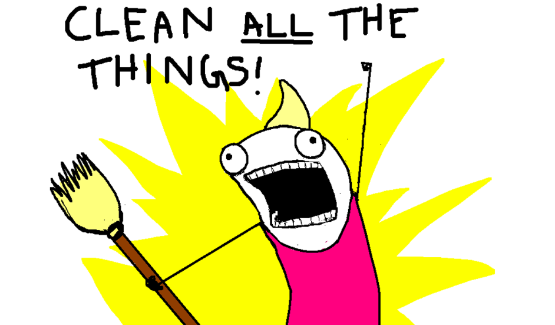
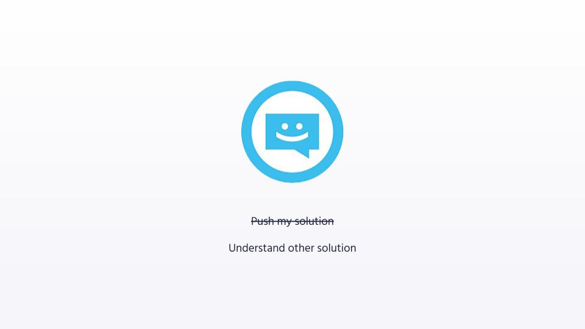
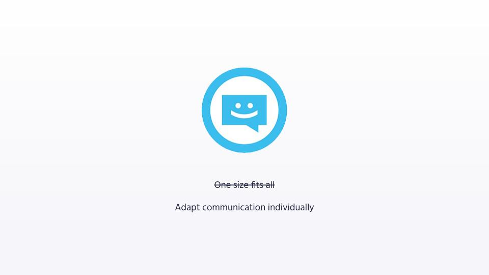
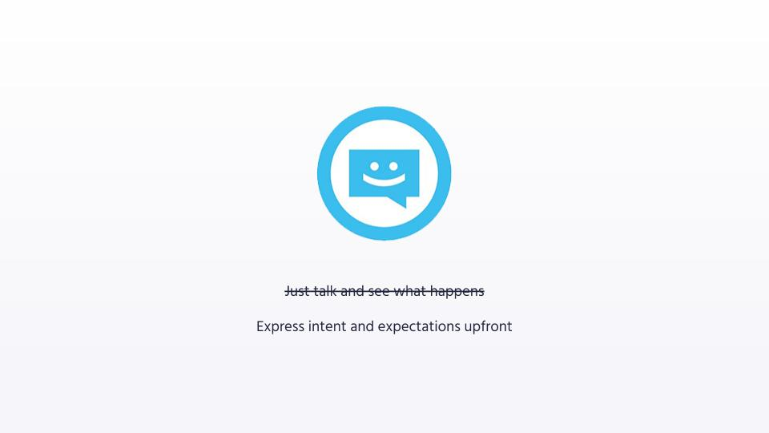
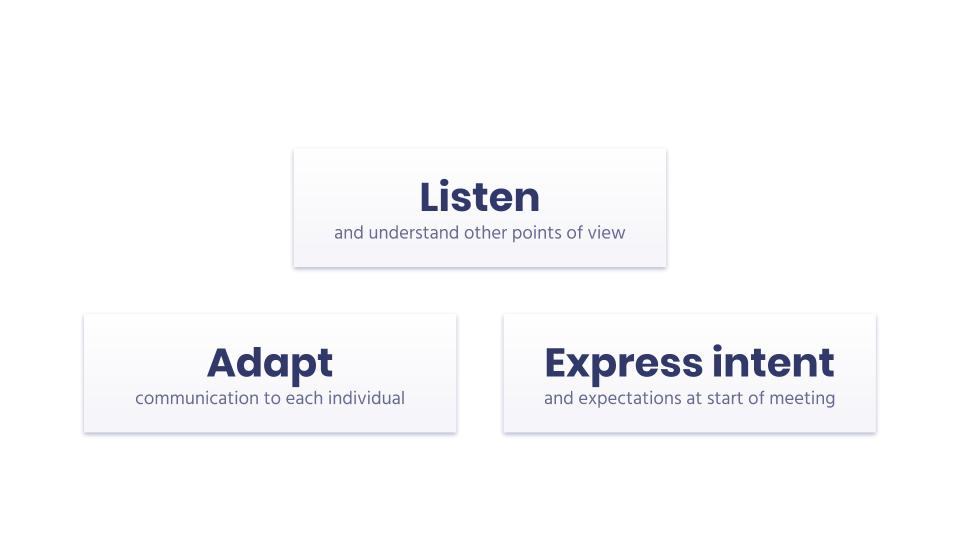

Most of my career (so far), I have lead teams as a "[benevolent dictator](https://wiki.p2pfoundation.net/Benevolent_Dictator)". Meaning that I have the vision of what we want to achieve as a team, but I am also the one prescribing the way we implement that vision. As a consequence, I expect my team to follow my lead, and to object just if I overlook anything important. Implementing this leadership style has been very effective, until I joined Algolia.

Besides the fact that, at Algolia, my team and I had more years of experience than my previous teams, the culture of the company made it ineffective to keep implementing this leadership style. So, with help from [my manager](https://www.linkedin.com/in/daguenet/), I had to take a step back and develop my soft skills in order to lead effectively in that new organization.

In this article, I share three stories which show an objective that I failed to achieve with my team, and how I finally tackle it. Then, I present a few strategies that helped me become a more effective Tech Lead in that team.

My goal is to help you communicate effectively with your team and avoid making the same mistakes as me. As a Tech Lead, or as a regular Individual Contributor.

## *The Elephant in the Room*

Two years ago, I joined Matthieu in the [Crawler](https://www.algolia.com/products/crawler/) team. Matthieu had created the Crawler from scratch, 6 months prior. I had set a mission to myself: make the Crawler grow from a proof of concept into a product which our enterprise customers can confidently rely on.

So I started challenging Matthieu on how to make the Crawler “rock-solid” for the long run. After adding automated tests, I suggested removing a feature that I thought was too complex to operate and maintain for a first version of the Crawler. Matthieu did not agree with me. And every time we talked about it, he looked very passionate about that feature.

He was so passionate that, at the time, I thought that he wanted to keep that feature because he was attached to the code he wrote for it. After all, I could relate because I did feel passionately attached to code I wrote, more than once. So I tried hard to sell him the benefits of removing code despite the attachment. The dispute lasted for months. It became so big that we both avoided talking about it. This topic was known as taboo in the whole team. We could not come to a decision to satisfy us both, and this lack of decision was impacting other developments of the Crawler. So we were both frustrated, and this situation slowed down the development of the product.

It took me months to understand that I was making a mistake. When I officially became the Tech Lead of the team and Raphaël became our manager, he advised us to listen to each other's point of view with an open mind. Without assuming anything. Without proposing alternatives. The goal was to walk in each other's shoes. To understand the deep motivations that drove us to our opinions.

This advice worked better than I expected. First, we sat down to share our respective intentions, regrets and apologies. It was hard, but it helped us re-create trust and care between us. And after three discussions, I understood the vision that led Matthieu to create that feature, I agreed with it, and we finally converged to a decision that was working and motivating for both of us!

What did I learn from this story? To move forward in the same direction, we must start by taking the time to *really* listen to each other. By understanding each other's vision, motivations and preferences, we can converge to solutions that will be implemented with care.

## *Let's All Pair!*

The following quarter, I wanted to help my team-mates grow. One was intimidated by the maintenance of [our Kubernetes clusters](https://blog.algolia.com/challenging-migration-heroku-google-kubernetes-engine/). Another needed help to define an action plan for the development of a big feature. And another was stuck on how to test a feature he had implemented. So I set up pair programming sessions with each of them.

With the first two ones, sitting down and tackling the issues together went great. With the last one, it was more complicated.

My colleague and I sat down, and I started to challenge him gently on what we wanted to test. I was struggling to get my colleague to come up with answers. This surprised and frustrated me, because I knew that he was very smart and saw no reason why he was not responding. In fact, we were both frustrated. I had not only failed to help him during that session, I had also created a bad experience between us.

Later, during a team building event, that colleague expressed two preferences towards the team: “I usually want to solve my problems on my own” and “if you want to ask me something specific, be straight to the point”. That explained why he did not respond to the way I challenged him, during our pair session!

From that day, I stopped proposing pair sessions with him. Instead, I gave him clear and direct suggestions, mostly when I review his Pull Requests.

What I learned from this experience is that there is no “one size fits all” way to lead a team. Everyone is different. So I must adapt my communication to each team-mate.

## *Cut Short*

As a Tech Lead, one of my responsibilities is to challenge my team in order to reduce the risk of outages and incidents in production.

One day, I found a point of failure in our system. So I wrote down several ideas on how to fix it, shared them with the team, and set up a meeting to ask for feedback and suggestions.

As I was presenting the problem to the team, one of my colleagues interrupted me because he didn't agree with one of the points I was making. This interruption caught me off-guard. I lost the self-confidence I needed to properly deliver my message. So I was frustrated and a little bit mad at my colleague for not having let me finish.

By chatting with my colleague after the meeting, I understood that the interruption was triggered by a misunderstanding that I could have avoided if I had been able to finish my intervention. Also, my colleague did not mean harm, he just wanted to save us some time. I could have anticipated his reaction. And therefore, I should have better prepared for it.

Later, I learned a communication technique that would have prevented that situation: share my intent and expectations at the beginning of the meeting. By doing so, I could have defused the interruption by saying: “we agreed that I would welcome your feedback AFTER I'm done introducing the problem”, and then keep going.

## Learnings

In summary, these stories taught me three important lessons:

- It's easier to converge to decisions with my team if I take the time to really understand their ideas, and why they believe in them, rather than pushing my own.
- My communication is more effective when I adapt to the individual preferences, values, drivers and triggers, for each of my collaborators.
- During meetings, my interventions are more effective when I start by sharing my intent and setting expectations.

In a nutshell, it's about getting to know your colleagues, and sharing your intent explicitly.

In the Crawler team, we got better at this by writing *Personal READMEs*.

## Personal README at the Rescue

What's a Personal README? It's a document in which one expresses their personal traits that may be useful for others to better communicate, collaborate and behave with them.

You can write your Personal README by replying to a set of personal questions.

Here are some examples:

- What I think are my strengths
- What people misunderstand about me
- What makes me uncomfortable
- What I value from others
- How to communicate with me

With the Crawler team, we shared some of our answers live, in front of each other, which triggered many surprises and interesting discussions.

Also, showing some vulnerability can go a long way. 

For instance, here are two extracts from [my Personal README](https://github.com/adrienjoly/adrienjoly.github.com/blob/master/README.md):

- Some people see me as a cold person or think that I don't like them. In reality, I just look very serious when I think.
- Sarcasm can make me uncomfortable, because sometimes I don't detect it and feel stupid afterwards.

Writing a Personal README is also a good exercise of introspection and of empathy. It helps putting yourself in your colleagues' shoes.

Warning: before asking your whole team to do it, make sure that everybody consents and intends to do it seriously. I recommend starting with a smoother exercise, like “Madeleine de Proust”. (from [Passez en mode workshop !](https://www.amazon.fr/Passez-workshop-ateliers-am%C3%A9liorer-performance/dp/2744066583/), by Jean-Michel Moutot and David Autissier)

## Conclusion

When I joined Algolia, I assumed that communication was going to be easy. Indeed, each employee was hired after showing that they embody the values of the company: grit, trust, care, candor and humility.

Even though we share the same values, it's important to keep in mind that we all are unique individuals, with heterogeneous goals, drivers, preferences and behaviors. So, in order to be an effective Tech Lead and colleague, I had to take a step back and re-think the way I communicate with each of them. By adapting to them individually. 

I hope that the learnings from these stories will spare you the trouble of making the same mistakes as me. Also, it's awesome if you decide to write your own Personal README. And, maybe, share it with your team!

If you want to go further with improving the effectiveness of your team communication and leadership, Raphaël and I recommend to learn about:

- [Nonviolent Communication](https://en.wikipedia.org/wiki/Nonviolent_Communication), as a way to solve interpersonal conflicts which involve emotions;
- [Assertiveness](https://en.wikipedia.org/wiki/Assertiveness), the skill of staying self-assured and confident, by disarming aggressive, passive or manipulative behaviors;
- [Soft Skills Engineering](https://softskills.audio/), a weekly podcast that helped me cope with difficult situations, in a fun way.

Also, don't hesitate to share your learnings and/or ask questions [on Twitter](https://twitter.com/intent/tweet?text=@adrienjoly%20My%20question%20in%20response%20to&url={{ site.url | url_encode }}{{ page.url | url_encode }}), or [on GitHub](https://github.com/adrienjoly/adrienjoly.github.com/issues/7).

> I would like to thank:
>
> - [Raphaël Daguenet](https://www.linkedin.com/in/daguenet/) for supporting and helping me grow in my Tech Lead role, and for co-writing this post with me;
> - [Alexandre Collin](https://www.linkedin.com/in/alexandrecollin) for having told me about Personal README, and sharing some tips;
> - PeterV for helping me improve the quality of this talk, before it was a blog post;
> - And the Crawler team for their patience and understanding while I was figuring out my communication with them. Also, for having shared their Personal README and having accepted that I share these stories.
