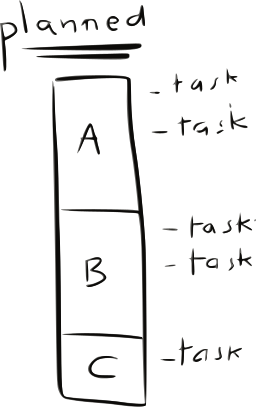
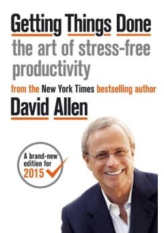
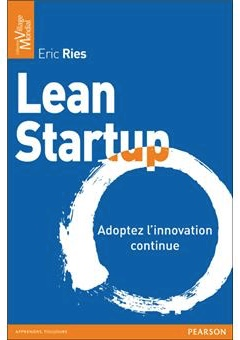
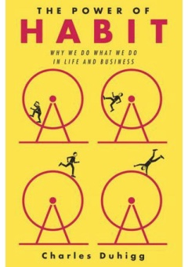

class: center, fit-bg-image
background-image: url('img/banner.jpg')

# Work on 10 projects simultaneously, using Trello 🔥

.bottom-left[
    
]

.bottom-right[
    @adrienjoly
]

---
class: full-bg-image
background-image: url('img/screenshot-trello-board.png?_nosteps')

.inversed[
    # My Trello Board
]

???

... finalement, je suis pas sur 10 projets mais 12 en ce moment. heureusement ce n'est que temporaire ! => teasing: mon board trello.

dans mon trello, je n'ai pas un board par projet, mais une carte par projet !

je me présente:

- j'enseigne 1j/semaine la prog javascript à l'EEMI
- je joue de la batterie dans un groupe
- je lance un MOOC sur la création de startup
- TO SHIP: quelques projets de développement + burning man
- TO MAINTAIN: next step, marketing, side projs, PDEV...

---
class: full-bg-image, inverse
background-image: url('img/bootstrapping.jpg')

# Multi-bootstrapping

???

- story:
    1. startup dev: 4.5 years
    2. freelancer: 1.5 years
    3. now: try my own ideas => make my own products
- objective: create income independently
    - challenges: finding product-market fit, and waiting for xp results
    - decision: boostrap several projects at the same time
- productivity workflow => high efficiency w/o burn out

---
class: center, middle, dbl-size

1. My workflow
2. "Next Step for Trello"
3. Tips

---
class: center, middle, dbl-size
# My workflow

---
.inversed[
    # Workflow
]
.center[
    
]

???

My workflow:

- 13-week process
- Weekly process
- Daily process
- Per-project process

???

inspiré par "self journal":
- deadline à 13 semaines pour mon objectif
- chaque semaine, je planifie et mesure mon avancement
- chaque jour aussi.

maintenant on va rentrer dans le détail de chaque process.

---
class: full-bg-image, inverse
background-image: url('img/13-week-plan.jpg')

# 13-week process

???

- 1 final "result" goal
- 3 progress goals (metrics)
- 3 actions per progress goal
- 1 commitment (e.g. date)
- expected impact <- WHY
- reward
- habits intended, for good execution

---
.inversed[
    # Weekly: planning
]

.center[
    
]

???

Every week:

- Decide how many hours to invest per project
- Pick "next steps" that fit invested project time

---
class: fit-bg-image, center, middle
background-image: url('img/checklist-bare.png')

.inversed.top-left[
    # Weekly: next steps
]

???

- Next steps must be precise and ordered for each project
- Must be able to estimate the duration of each next step
- I made an extension for that => we'll get back to this later

---
class: full-bg-image
background-image: url('img/screenshot-calendar.png?_refresh')

.inversed[
    # Weekly: schedule
]

???

[ FOR MAKER-SCHEDULE PEOPLE ONLY ]

When I know how much time per project + what steps to do:

- schedule the steps in my calendar
- leave some free time, just in case
- make a snapshot, then adjust the calendar to what I actually did

=> I know exactly:

- what I'm supposed to do, at all times
- what tasks I can move, and to when
- when I'm free to other things

---
class: fit-bg-image
background-image: url('img/weekly2.svg')

.inversed[
    # Weekly: review
]

???

Weekly process:

- Hours per project: track & then compare with previsions (ask yourself "why?")
- Sum up main wins and lessons of the week => adopt solutions to improve
- Repeat process for following week

---
class: center, middle, dbl-size

.inversed.top-left[
    # Daily process
]

1. 🌅 Routine
2. 🙉 Focus
3. 🔍 Review
4. 🗒 Prepare

???

- morning: read targets of the day, write objective, gratitude, exercise
- focus on planned activities, one task at a time
- adjust tasks in calendar, if necessary, to reflect actual use of time
- end of day: write wins and lessons of the day + mood
- write down targets of next day

---
class: full-bg-image, inverse
background-image: url('img/trello-card.png')

# Per-project process

???

- one trello card per project:
    + description <- links to all associated documents (e.g. google drive, etc...)
    + checklists <- "next steps" (sorted tasks)
    + comments <- news / project journal

---
class: center, middle, dbl-size
# "Next Step for Trello"

---
class: full-bg-image
background-image: url('img/screenshot-trello-board.png?_nosteps')

.inversed[
    # Before
]

---
class: full-bg-image
background-image: url('img/screenshot-trello-board-steps.png')

.inversed[
    # After
]

---
class: center, middle

.inversed.top-left[
    # Modes
]

---
class: center, middle

.inversed.top-left[
    # Checking tasks
]

---
class: full-bg-image
background-image: url('img/next-step-chrome-web-store.png')

.inversed[
    #  🔗 ajo.ovh/nextstep
]

---
class: center, middle, dbl-size
# Tips

---
class: center, middle, dbl-size

.inversed.top-left[
# 1. Know yourself
]

- Goals & WHY
- Priorities
- Behavior: assets & flaws ([symptômes](https://docs.google.com/forms/d/e/1FAIpQLSd32ygoWImW1muOo38D2YnN1Fk-7gPe7r9VG-PTr393TB0tiw/viewform))

???

- think about who you are,
- what is it that you're running after, why,
- how much time you intend to spend on what. (projects and/or kind of activities)
- and how you behave/react to regular situations => what are your flaws, (cf MBTI test)

---
class: center, middle, dbl-size

.inversed.top-left[
# 2. Plan ahead
]

- Targets & deadlines
- Commit time
- Split tasks
- Breaks & free time

???

- set objectives
- set deadlines
- commit sections of time to specific activities
- split your tasks into small and clear steps
- always keep enough free time aside for fun/leasure/relaxing, and for the unexpected

---
class: center, middle, dbl-size

.inversed.top-left[
# 3. Focus
]

- Bin of thoughts
- Avoid interruptions
- Plan distractions
- Content before form

???

- find way to get ideas out of your mind quickly
- find ways to really focus, shut down interruptions, close non-necessary apps and tabs
- plan distractions (ex: facebook)
- group social interactions into small chunks, at distant intervals
- inform others of your intents, and comm. preferences (how to reach you)
- structure -> content -> details. (ex: use an outliner and/or markdown)

---
class: full-bg-image
background-image: url('img/screenshot-inbox.png')

.inversed.bottom-left[
# ❤️ Google Inbox
]

---
class: full-bg-image
background-image: url('img/screenshot-inbox-add.png')

.inversed.bottom-left[
# ❤️ Google Inbox
]

---
class: center, middle, dbl-size

.inversed.top-left[
# 4. Take a step back
]

- Feel
- Adjust
- Share

???

- At end of each period (day, week, 13-week objective), take time to think of what you did (vs your initial expectations), 
- don't be too hard on yourself => just adapt your level of expectations, process, and/or tools.
- share your journey and learnings with others

---
class: center, middle, dbl-size

.inversed[
# 5. Happiness & Health > Efficiency
]

---
class: center, middle, dbl-size
# Merci ! 🙌

.col[]
.col[]
.col[]
.col[]

@adrienjoly • [ajo.ovh/slides-trello](http://ajo.ovh/slides-trello)
