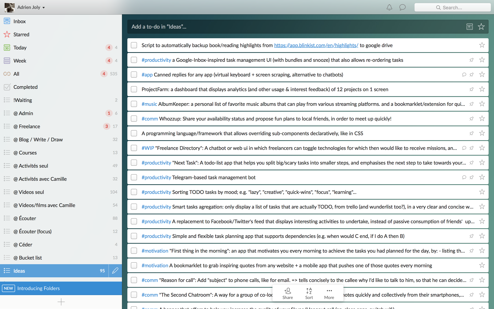

class: center, middle, dbl-size
# Work on 10 projects without burning out 🔥

@adrienjoly (.com, twitter, medium, github)

---
class: center, middle, dbl-size

- Story
- Workflow
- Tips

---
class: center, middle, dbl-size
# Story

---
# 5+ years ago: Thesis

thesis => notes on paper

---
# 3 years ago: Startup

startup => shared trello board + personal todo-list

???

getting interested in productivity

---
# 2 years ago: Freelancing

freelancing => todo-list only

???

progressively improving my workflow, to be efficient, while preventing burn out

---
# Now: Multi-bootstrapping

???

TODO: explain why I came to this:

- symptoms
- objectives
- ...

and why I plan more.

---
class: center, middle, dbl-size
# Workflow

---
class: center, middle, dbl-size
# Workflow

- 13-week process
- Weekly process
- Daily process
- Per-project process

---
# 13-week process

- 1 result goal
- 3 progress goals
- 3 actions per progress goal
- 1 commitment (success criteria)
- expected impact
- reward
- intended habits, for good execution

---
# Weekly process

- count time spent per project => compare with previsions
- sum up main wins and lessons of the week => adopt solutions
- list and order next steps for each project
- schedule steps in the calendar => snapshot the calendar (initial plan)

---
# Daily process

- morning: read targets of the day, write objective, gratitude, exercise
- focus on planned activities, one task at a time
- adjust tasks in calendar, if necessary, to reflect actual use of time
- end of day: write wins and lessons of the day + mood
- write down targets of next day

---
# Per-project process

- one trello card per project:
    + description <- links to all associated documents (e.g. google drive, etc...)
    + checklists <- "next steps" (sorted tasks)
    + comments <- news / project journal

---
class: center, middle, dbl-size
# Tips

---
class: center, middle, dbl-size
# Tips

- Know yourself
- Plan ahead
- Focus
- Take a step back

---
# 1. Know yourself

- think about who you are,
- what is it that you're running after, why,
- and how you behave/react to regular situations => what are your flaws, (cf MBTI test)
- how much time you intend to spend on what. (projects and/or kind of activities)

---
# 2. Plan ahead

- set objectives
- set deadlines
- commit sections of time to specific activities
- split your tasks into small and clear steps
- always keep enough free time aside for fun/leasure/relaxing, and for the unexpected

---
# 3. Focus

- find way to get ideas out of your mind quickly
- find ways to really focus, shut down interruptions, close non-necessary apps and tabs
- plan distractions (ex: facebook)
- group social interactions into small chunks, at distant intervals
- inform others of your intents, and comm. preferences (how to reach you)
- structure -> content -> details. (ex: use an outliner and/or markdown)

---
# 4. Take a step back

- At end of each period (day, week, 13-week objective), take time to think of what you did (vs your initial expectations), 
- don't be too hard on yourself => just adapt your level of expectations, process, and/or tools. main objective: be happy and healthy :-)
- share your journey and learnings with others

---
# 5. Objectives < Happiness and Health

---
class: center, middle, dbl-size
# Thank you!

@adrienjoly (.com, twitter, medium, github)
