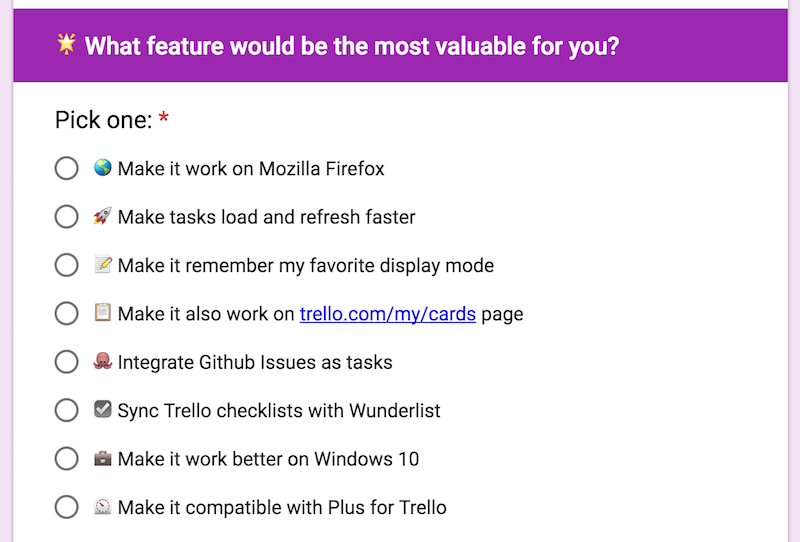

class: center, fit-bg-image
background-image: url('img/banner.jpg')

# The Development & ~~Monetisation~~ of NS4Trello

.bottom-left[
    
]

.bottom-right[
    @adrienjoly
]

---
class: center, middle, dbl-size, inverse
# I - The Project 💡

---
class: full-bg-image, inverse
background-image: url('img/1-rambo.jpg')

???

(image: soldat bien équipé, prêt à partir, déterminé)

after 4.5 years leading the dev of an online music platform,
  and 1.5 years building websites for clients,
  I wanted to make my own product, and monetise it!
    (get out of my INTJ comfort zone)

hashtag #gonfléàbloc

---
class: full-bg-image, inverse
background-image: url('img/1-ideas.png')

???

" ideas were not lacking! "

topic of interest at the time: productivity.
  => let's do a productivity app!

but too many todo-list apps already...
  => let's not re-invent the wheel!

also, something that I could use.

---
class: full-bg-image, inverse
background-image: url('img/1-bootstrapping.jpg')

???

at the time, I had decided to develop several projects at the same time, and was using a Trello board to track my progress on those projects.

---
class: full-bg-image, inverse
background-image: url('img/1-trello.jpg')

???

one card per project => next steps as checklist items
  => pb: need to open card to see next steps...

IDEA: let's improve Trello, let's make a useful extension to see next steps from the board!
Assumption: it will be so useful that some people will pay me for this!

---
class: center, middle, dbl-size, inverse

???

I started by doing what I'm best at: coding.

...but caution: let's not overdo it => let's MVP! #leanstartup

---
class: full-bg-image, inverse
background-image: url('img/1-screenshot-trello-board.png')

???

After a few days => 1st working prototype => super useful!

=> let's launch on ProductHunt to hook some users!

---
class: full-bg-image, inverse
background-image: url('img/1-producthunt-launch.jpg')

???

Launch went super well => 400 upvotes in one day!

---
class: center, middle, dbl-size, inverse

???

I was very happy!
Confirmation that my product was useful!

Now, let's monetise! :-D

---
class: center, middle, dbl-size, inverse
# II - The Making 💰

---
class: center, middle, dbl-size, inverse, full-bg-image
background-image: url('img/2-doing.gif')

???

Now, how to make money from this?...

Let's ask users!
Let's make a survey about what's missing,
  and how much they'd pay for it!

---
class: center, middle, inverse

???

Survey went well:
- 100 answers
- ~5 ready to pay 10<50$
- 1/4 ready to pay <10$

=> Let's crowdfund v2.0!

---
class: full-bg-image, inverse
background-image: url('img/2-kickstarter.png')

???

FAIL => peaked at 40$ at the beginning, then stalled

So I thought, maybe I should show my dev process,
to gain some trust from users?

=> Livecoding on Twitch!

---
class: full-bg-image, inverse
background-image: url('img/2-users-6k.png')

???

My efforts made the user count and ratings grow,
but users were still not paying for v2...

=> the campaign died.

=> no money.

---
class: center, middle, dbl-size, inverse
# III - The Post-Mortem ☠️

---
class: center, middle, dbl-size

# Conclusions?

- Users are ungrateful
- Surveys are full of lies
- Kickstarter works for cheaters

---
class: center, middle, dbl-size

# Conclusions?

- Users are ~~ungrateful~~ confused
- Surveys are full of lies
- Kickstarter works for cheaters

---
class: center, middle, dbl-size

# Conclusions?

- Users are ~~ungrateful~~ confused
- Surveys are ~~full of lies~~ optimistic
- Kickstarter works for cheaters

---
class: center, middle, dbl-size

# Conclusions?

- Users are ~~ungrateful~~ confused
- Surveys are ~~full of lies~~ optimistic
- Kickstarter works for ~~cheaters~~ awesome products

---
class: center, middle, dbl-size

# Conclusions

- Users are ~~ungrateful~~ confused
- Surveys are ~~full of lies~~ optimistic
- Kickstarter works for ~~cheaters~~ awesome products
- I should have found **clients** before coding

---
class: full-bg-image, inverse
background-image: url('img/3-users-10k.png')

???

While I was focused on other projects,
User base kept growing.

=> Last chance:

---
class: full-bg-image, inverse
background-image: url('img/3-free-advice.png')

???

Help people for free => they'll ask for help!

=> negociating a deal with a consultant
(commission for leads)

---
class: center, middle, dbl-size, inverse
# IV - Back to Coding 😍

???

Learnt a lot about marketing, people, and myself.
=> I know that I want to do what I love: coding!

... and Algolia seems like an awesome place for that! :-)
