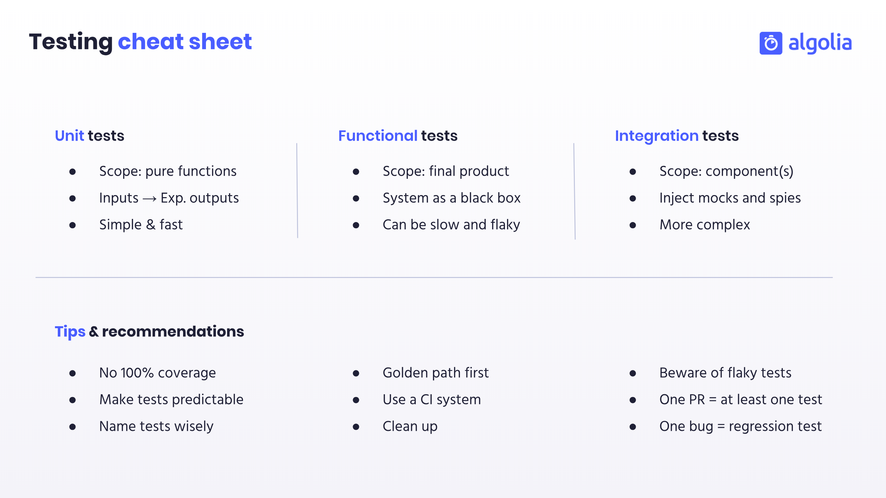

# How to write automated tests



## How to run the tests locally

You will need Node.js installed before running the following commands from your shell/terminal:

```bash
$ svn export https://github.com/adrienjoly/adrienjoly.github.com/trunk/slides/testing/sample-tests sample-tests
$ cd sample-tests
$ npm install
$ npm test
```
