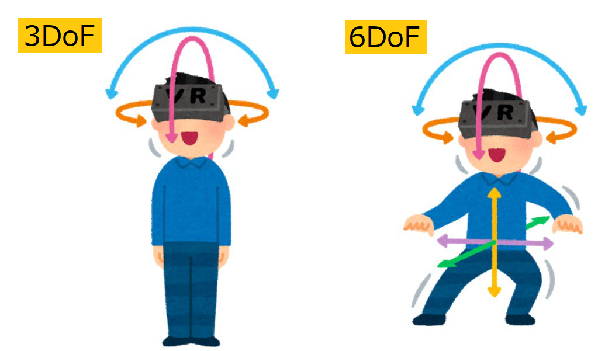

Image Credit: LIV (found on https://vrscout.com/news/oculus-quest-mixed-reality-tools/)

Virtual Reality used to be a niche technology that came with many shortcomings: price of necessary equipment, complexity and discomfort of use, lack of games and experiences...

Cardboard-based VR headsets helped more people discover the joy of feeling immersed in 360-degrees environments, thanks to their very low price and the fact that most people are already equipped with a smartphone that can make it work. But the immersion only went so far: the quality of games and experiences that support them is very variable, and most importantly: the interactivity is very limited.

The **Oculus Quest VR headset is a game changer** because:

- Overall, it's a **great compromise** between cardboard-based VR headsets and the most immersive (but expensive) VR equipment available to date. It allows the best level of immersion. The only (minor) drawback compared to higher-end headsets is that the quality of graphics is a bit lower, both in terms of resolution and in terms of details of the 3D environments.

- For ~$400 (i.e. cheaper than most VR headsets), you can experience **6 degrees of freedom** (a.k.a. "6DoF", as illustrated on the image below), meaning that the VR experiences respond not only to the movements of your head, but also to the movement of your whole body. I.e. when physically *walk* forward, the character you incarnate in the experience also walks forward. The same applies to your hands, thanks to the 3d-positioned controllers.

- You don't need to own a gaming PC (which is usually the case with higher-end VR headsets), the Oculus Quest is as **self-contained** as a game console. As long as it's connected to WiFi, you can turn it on and play immediately.

- You **don't need to install radars** (which is the case for many higher-end VR headsets) in the corners of the room in which you plan to use the headset, because Oculus Quest embeds cameras to locate itself and the two controllers within your room, in real time. This makes it easy to carry the headset with you and let friends and family try it, in any room.

- So, if you want to enjoy immersive VR games and experience in the comfort of your home, buying an Oculus Quest is a no-brainer!

## First steps with Oculus Quest

<!-- from https://twitter.com/adrienjoly/status/1161896322699603968 -->

If you recently bought an Oculus Quest, welcome to the club!

Here are a few tips and recommendations for you:

- Set the headset in a **comfortable position**:
  1. loose all the straps
  2. wear the headset, and hold it with one hand, in a position in which you see the screen clearly. Adjust the distance between eyes if necessary.
  3. tighten the top strap first, so the bottom cord holds under the very back bone of the rear of your skull. (to take on some of the weight of the headset off the front of your head)
  4. then, tighten the side straps, so the headset remains in position even when you move your head.
  5. if needed, tilt the front, to balance the pressure equally between your forehead and your cheek bones.

- You can play **seated**, either by changing game settings or reducing your height in your Oculus profile

- Long-press Oculus button to **re-center the view** in direction of your choice

- Chat and discover experiences with other Oculus Quest users from all around the world, on the ["Oculus Quest" Facebook group](https://www.facebook.com/groups/vrmai/).

- **Lenses** are sensitive to scratches. If you usually wear glasses, use the provided spacer, or (like me) don't wear them while you're in the headset.

- Also: [How To Clean VR Headset Lenses Properly + Stop Fogging - YouTube](https://www.youtube.com/watch?v=Q_weiJGXQs0)

## Free VR Experiences to try at least once

- Slice boxes flying to you on the rhythm, with [moonrider.xyz](https://moonrider.xyz/) (alternative to **Beat Saber** and BoxVR)
- **Climb** in [VRChat](https://www.oculus.com/experiences/quest/1856672347794301/)
- Play **paintball** with your friends in [RecRoom](https://www.oculus.com/experiences/quest/2173678582678296)
- Explore the [ISS](https://www.oculus.com/experiences/quest/2094303753986147) in **zero-gravity**

## My favorite SideQuest games and experiences

You "side load" games and experiences that are not listed on the official Oculus store by [installing SideQuest](https://sidequestvr.com/#/setup-howto) on PC or Mac.

After doing so, check out these awesome games and experiences:

- [Crisis VRigade](https://sidequestvr.com/#/app/38) is an excellent rail shooter (like Time Crisis) that is easy to understand but takes some practice to master. Hide behind cars and walls to avoid enemy bullets while you reload your gun. Don't forget to team up with some friends!
- [Pavlov: Shack](https://sidequestvr.com/#/app/392) is basically "counterstrike" for VR. You can play against bots but I guess that it's more fun with a team of friends.
- [Tea For God](https://sidequestvr.com/#/app/65) is a futuristic shooting game that will adapt to your playing room, so you can move into rooms and elevators by actually walking infinitely, without ever running into a wall. It's very hard to describe, you gotta experience it yourself!
- [QuakeQuest](https://sidequestvr.com/#/app/93) and [Quake2Quest](https://sidequestvr.com/#/app/353) are ports of the well-known 1st-person shooters on Oculus Quest. The six degrees of freedom enabled by Oculus Quest bring them to another level!
- [Lambda1 VR](https://sidequestvr.com/#/app/124) is a port of Half-Life on Oculus Quest. Like for Quake and Quake 2, you will have to upload the data files from the PC game. (I think it works with the free demo, too)
- [Descent Alps](https://sidequestvr.com/#/app/668) is a ski simulator in which you turn by leaning your weight in the direction of the turn.

- Also check out [10 Other Awesome Things You Can Do In VR](https://youtu.be/KecTUGt-ATA) (by Cas and Chary, on YouTube)

<!-- also, the list of games and experiences I bought/downloaded from the Oculus store: https://drive.google.com/open?id=1V0CjTnBa8r1AYe91zLCthasnfXB4Mso9 -->

## Play PCVR games from Steam

The Oculus Quest is a standalone VR headset, meaning that it does not need to be connected to a PC in order to work.

That said, there is a much wider selection of VR games available on Steam, and you can experience them with your Oculus Quest if you have a Windows-based PC computer (including cloud-based, e.g. [Shadow](https://shadow.tech/)).

Here is a selection of PCVR games I've enjoyed: [No Man's Sky](https://store.steampowered.com/app/275850/No_Mans_Sky/), [Windlands 2](https://store.steampowered.com/app/458580/Windlands_2/), [VTOL VR](https://store.steampowered.com/app/667970/VTOL_VR/), [STAR WARS™: Squadrons](https://store.steampowered.com/app/1222730/STAR_WARS_Squadrons/), [American Truck Simulator](https://store.steampowered.com/app/270880/American_Truck_Simulator/), and [Half-Life: Alyx](https://store.steampowered.com/app/546560/HalfLife_Alyx/), 

### How

There are several ways to connect the headset with the PR, including Oculus Link and [Virtual Desktop](https://www.vrdesktop.net/). I've been very satisfied by the latter.

Requirements: a PC powerful enough to run VR experiences, Steam running on Windows, a very good WiFi router.

To play PCVR games running on my Shadow (cloud-based PC) via Virtual Desktop, I followed the following tutorials:

- [Tuto Shadow Oculus quest et Virtual desktop - VR-gamerz.fr](https://www.vr-gamerz.fr/2020/08/21/tuto-shadow-oculus-quest-et-virtual-desktop/)
- [How to Setup Shadow PC With Oculus Quest: Cloud Gaming PC!](https://arvrtips.com/setup-shadow-pc-with-oculus-quest/)

### Good to know: the situation with controllers

Unfortunately, playing PCVR games on the Oculus Quest usually requires more setup than native games installed from the Oculus store. The most frustrating problems I've faced were about setting up controls. Indeed, there there different cases:

- ideal: VR games that directly support "Oculus Touch" controllers, e.g. Half-Life: Alyx => they will work right away!
- workable: games that support VR with regular game controllers (e.g. XBox / PlayStation), e.g. STAR WARS™: Squadrons => you can either use a regular USB controller, or emulate such controller with your Oculus Touch controllers (that's a feature of [Virtual Desktop](https://www.vrdesktop.net/))
- complicated: games that allow the use of a VR headset but expect to be controlled with a keyboard and mouse, e.g. American Truck Simulator and Elite Dangerous => playing with your Oculus Touch controllers (for best immersion) is possible but it will take some effort. (see below)

### Tips & Tricks

#### My game does not support my Oculus Touch controllers!

First, try to enable "gamepad emulation" in Virtual Desktop and restart the game.

If the emulated layout is not practical enough, follow these steps:

0. quit the game and disable "gamepad emulation" in Virtual Desktop (for now)
1. in Steam, activate the "Big Picture" mode
2. in Virtual Desktop, re-enable "gamepad emulation"
3. back in Steam's Big Picture mode, use your controllers to navigate to your game
4. on the game's page, navigate to the "Manage" (or "Settings") tab
5. if it's not yet active, activate "Steam Input"
6. navigate to "configure controls"
7. bind the game controls to each button, trigger and stick of your Oculus Touch controllers
8. start the game to try these controls, and refine them if necessary

If you are trying to play a game which has many more controls than the Oculus Touch controllers provides, there are other options:

- Setup vocal commands with [VoiceAttack - Voice Recognition for your Games and Apps](https://voiceattack.com/)
- For flight simulators: use your Oculus Touch controllers as a HOTAS, with [ocujoy](https://github.com/lyneca/ocujoy) (experimental)

#### The game has started but I hear no sound, or I can't control anything!

When you start a game from Steam (or from Virtual Desktop) right after booting your PC, the game will start SteamVR, and SteamVR will steal the focus (or foreground) of the user interface, putting the game in the background. The easiest way to prevent this is to run SteamVR manually before starting the game. Otherwise, switch back to the "Desktop" and click on the game's icon, from Window's taskbar, to put the game back into the foreground.

#### The game has started but my character is much too high / the user interface is far below!

When your Oculus Quest is in "stationary" mode (i.e. not in "room scale"), it happens that the height of the headset is not sent correctly to the game by Virtual Desktop. In that case, switch the Oculus Quest to "room scale", and then back to "stationary" mode. When you go back to the game, the height of your POV (point of view) should be fixed.

Otherwise: if you have not enabled "gamepad emulation" in Virtual Desktop, you can use SteamVR's shortcut to reset the view: push both sticks for ~2 seconds.

## Create your own VR experiences

- Create a (basic) VR space that can be explored by anyone, in 5 minutes!
  1. Follow the tutorial on [hubs.mozilla.com/spoke](https://hubs.mozilla.com/spoke) on your computer's web browser, publish it;
  2. Open [hub.link](https://hub.link) on the headset's web browser;
  3. Type the 4-letter code from step 1 => You're in!
  
- Create (or remix) a VR experience with HTML and JavaScript code, thanks to [A-Frame](https://aframe.io) (WebXR framework).

  - Remix an existing game (e.g. [Spider-Physics](https://glitch.com/~spider-physics)) coded JavaScript/WebXR ([tutorial video](https://youtu.be/HqslsydOTvg))

  - Learn how to create your own VR game or experience with A-Frame: [Learn A-Frame (WebVR) - YouTube](https://www.youtube.com/playlist?list=PL8MkBHej75fJD-HveDzm4xKrciC5VfYuV)
  
  - For instance, I'm learning it step by step, by developing a space exploration and shooting game inspired by "Descent": [glitch.com/~pitch-gaudy-acai](https://glitch.com/~pitch-gaudy-acai).

  - Learning how to find, create and/or import 3D models into a a-frame scene:
    - [Where to Find Models – A-Frame](https://aframe.io/docs/1.0.0/introduction/models.html#where-to-find-models)
    - [Creating Custom 3D Objects for use with Three.js](https://www.youtube.com/watch?v=-gipbcWCifc), using [Vectary](https://www.vectary.com/) (3D modeling web app)
    - [Upload GLTF GLB 3D Model Animation to A-frame WebVR from Sketchfab](https://www.youtube.com/watch?v=mPiFPv9WzOw)
    - [Modeling a DeLorean in VR // GravitySketch + TiltBrush - YouTube](https://www.youtube.com/watch?v=HG3bzTwIuHc)

- You can also create VR games and experiences with Unity, or create rooms directly in VR (e.g. in RecRoom or VRChat), but I've not tried that yet.

- Other resources: [msurguy/awesome-webxr: Compilation of links for WebXR](https://github.com/msurguy/awesome-webxr)
